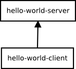
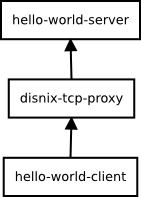

disnix-proxy-example
====================
This is a trivial example case to demonstrate how upgrades can be made completely
atomic by means of a TCP proxy. The example system consists of a very simple
server and client communicating through a TCP socket.

By using an alternative composition, a proxy is being used for communication
between the server and client, which is notified by Disnix before the upgrade
starts. The proxy then drains connections during the upgrade. In this phase,
Disnix waits until there are no activate connections before it starts the actual
upgrade.

New connections made by a client during this phase are queued. If there are no
activate connections the upgrade starts. After the upgrade the proxy is notified
to accept connections again.

We can also deploy a variant of the system in which the server is activated on
demand and self terminates if there are no open connections.

Architecture
============


The picture above shows the architecture of this example, consisting of a server
and a client. The server is a daemon listening for messages from the client. If
the server receives 'hello', it will respond by returning a 'Hello world'
message.



In the above picture, the architecture is extended with a proxy. This proxy is
notified by Disnix if an upgrade starts, draining the connections to make an
upgrade completely atomic.

Usage
=====
This example comes in three variants: you just deploy only the server and
client (without a proxy), include a proxy that monitors connections (and prevents
the system from being upgraded if somebody is connected), and a variant in which
the server is started on-demand as soon as somebody connects to it (this works
only when using `systemd` as a process manager).

Moreover, there are two kinds of deployment recipes containing all neccessary
Disnix models, such as a services, infrastructure and distribution models
required for deployment:

* The `deployment-simple/DistributedDeployment` folder contains simple recipes
  that work with any basic installation of Disnix on any system. It uses the
  `process` Dysnomia module to manage the process life-cycles.
* The `deployment/DistributedDeployment` folder contains more advanced recipes
  using the experimental
  [nix-processmgmt](https://github.com/svanderburg/nix-processmgmt) framework
  that can work with all kinds of process managers, such as sysvinit, systemd,
  launchd and supervisord.

Deployment using Disnix in a heterogeneous network
--------------------------------------------------
For this scenario only installation of the basic Disnix toolset is required.

First, you must manually install a network of machines running the Disnix
service. Then you must adapt the infrastructure model to match to properties of
your network and the distribution model to map the services to the right
machines.

The variant without proxy can be deployed by running the following command:

```bash
$ disnix-env -s services-without-proxy.nix -i infrastructure.nix -d distribution-without-proxy.nix
```

The variant with proxy can be deployed by running the following command:

```bash
$ disnix-env -s services-with-proxy.nix -i infrastructure.nix -d distribution-with-proxy.nix
```

The variant supporting systemd socket activation and self termination can be
deployed by running the following command:

```bash
$ disnix-env -s services-with-socketactivation.nix -i infrastructure.nix -d distribution-without-proxy.nix
```

The above example only works on Linux distributions having systemd as its
service manager.

Hybrid deployment of NixOS infrastructure and services using DisnixOS
---------------------------------------------------------------------
For this scenario you need to install a network of NixOS machines, running the
Disnix service. This can be done by enabling the following configuration option
in each `/etc/nixos/configuration.nix` file:

```bash
$ services.disnix.enable = true;
```

You may also need to adapt the NixOS configurations to which the `network.nix`
model is referring, so that they will match the actual system configurations.

The system including its underlying infrastructure can be deployed by using the
`disnixos-env` command. The following instruction deploys the variant without a
proxy:

```bash
$ disnixos-env -s services-without-proxy.nix -n network.nix -d distribution-without-proxy.nix
```

The following instruction deploys the variant with a proxy:

```bash
$ disnixos-env -s services-with-proxy.nix -n network.nix -d distribution-with-proxy.nix
```

The variant with socket activation can be deployed as follows:

```bash
$ disnixos-env -s services-with-socketactivation.nix -n network.nix -d distribution-without-proxy.nix
```

Deployment using the NixOS test driver
--------------------------------------
This system can be deployed without adapting any of the models in
`deployment/DistributedDeployment`. By running the following instruction, the
variant without the proxy can be deployed in a network of virtual machines:

```bash
$ disnixos-vm-env -s services-without-proxy.nix -n network.nix -d distribution-without-proxy.nix
```

By running the following instruction, the variant with proxy can be deployed in a
network of virtual machines:

```bash
$ disnixos-vm-env -s services-with-proxy.nix -n network.nix -d distribution-with-proxy.nix
```

The variant with socket activation can be deployed as follows:

```bash
$ disnixos-vm-env -s services-with-socketactivation.nix -n network.nix -d distribution-without-proxy.nix
```

The disadvantage of using the virtualization extension is that no upgrades can be
performed and thus the locking mechanism cannot be used.

Deployment using NixOps for infrastructure and Disnix for service deployment
----------------------------------------------------------------------------
It's also possible to use NixOps for deploying the infrastructure (machines) and
let Disnix do the deployment of the services to these machines.

A virtualbox network can be deployed as follows:

```bash
$ nixops create ./network.nix ./network-virtualbox.nix -d vboxtest
$ nixops deploy -d vboxtest
```

The services without proxy can be deployed by running the following commands:

```bash
$ export NIXOPS_DEPLOYMENT=vboxtest
$ disnixos-env -s services-without-proxy.nix -n network.nix -d distribution-without-proxy.nix --use-nixops
```

The variant with proxy can be deployed by running the following commands:

```bash
$ export NIXOPS_DEPLOYMENT=vboxtest
$ disnixos-env -s services-with-proxy.nix -n network.nix -d distribution-with-proxy.nix --use-nixops
```

The socket activation variant can be deployed as follows:

```bash
$ export NIXOPS_DEPLOYMENT=vboxtest
$ disnixos-env -s services-with-socketactivation.nix -n network.nix -d distribution-without-proxy.nix --use-nixops
```

Running the system
==================
After the system has been deployed, the hello world client can be started from
the command-line to the machine on which it is deployed, by typing the following
instruction:

```bash
$ /nix/var/nix/profiles/disnix/default/bin/hello-world-client
```

By typing: 'hello' the server returns 'Hello world'. By typing 'quit' the clients
disconnects.

If the system is using the proxy, try to upgrade the system while a client is
connected, e.g. by moving the hello world server from one machine to another.
You will notice that the upgrade does not start while the client is still
connected. If you try to connect to the server with another client, the
connection is queued. If you disconnect the client, then the upgrade will start.

License
=======
This package is released under the [MIT license](http://opensource.org/licenses/MIT).
